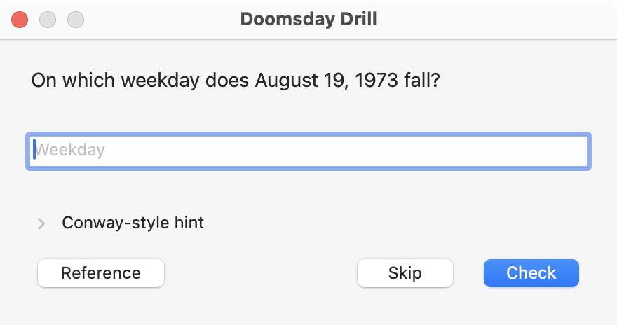
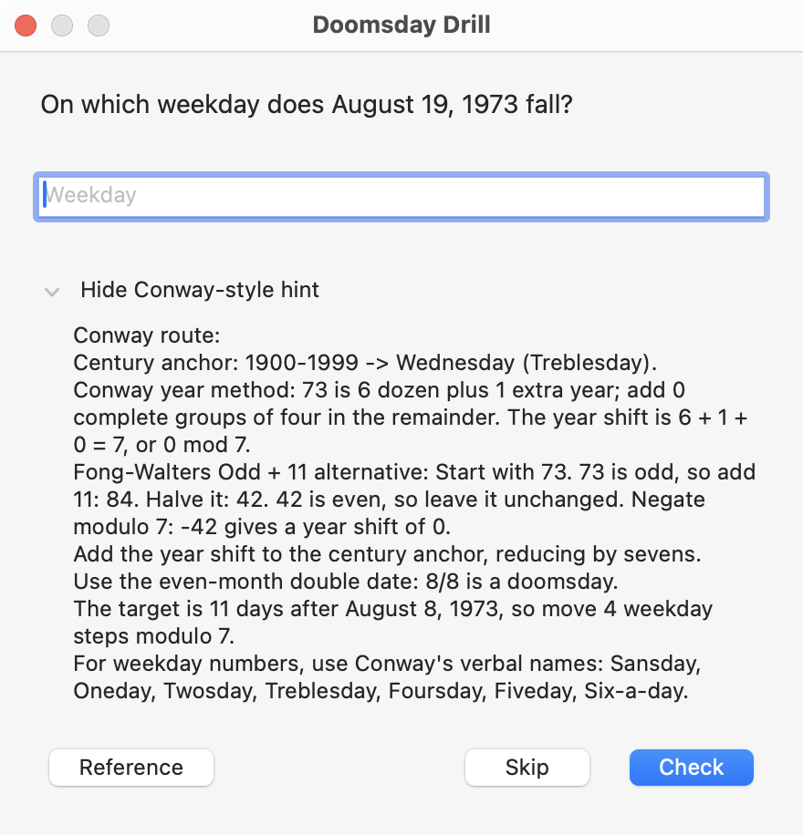
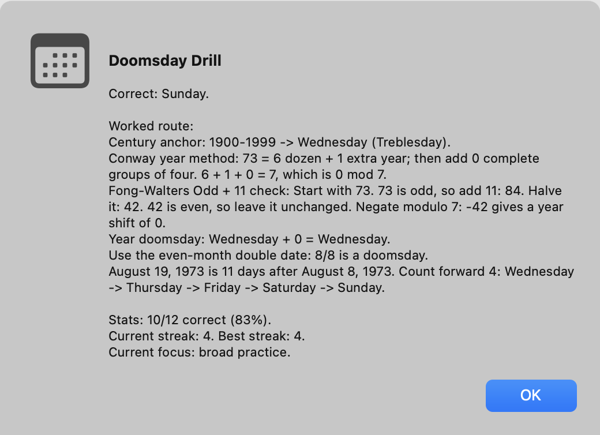

# Doomsday Drill

A macOS app for practicing John Conway's Doomsday Algorithm.
The app asks for the weekday of a date, then shows a worked calculation. It can
run on demand or after login and screen unlock; any question can be skipped.

<p align="center">
  
</p>

> Throw your calendar away after a quick glance to find the Doomsday, for when
> you know Doomsday you will know it all!

John Horton Conway, [*Tomorrow is the Day After Doomsday*][conway],
*Eureka* 36 (1973), pp. 28-31. [Original scan][scan] / [Publisher's archive][publisher]

[Conway demonstrates and explains the method in this video][video], published by
the Mathematical Association of America.

## The Drill

In any year, April 4, June 6, August 8, October 10, and December 12 all land on
the same weekday: that year's **Doomsday**. The algorithm uses this and a few
other anchor dates to calculate weekdays mentally.

- Full-date questions are mixed with questions about a year's Doomsday.
- Optional hints cover the century anchor, Conway's dozens method, month
  mnemonics, and the Fong-Walters **Odd + 11** shortcut.
- Answers include a worked calculation, with accuracy and streak statistics.
- After a mistake, you can identify the step that went wrong. Future questions
  give that part more attention.

<p align="center">
  <a href="docs/images/hint.png"></a>
  <a href="docs/images/feedback.png"></a>
</p>

*Actual app windows, using an example from Conway's article and sample statistics.*

## Running Locally

Requires **macOS 11 or later** and **Python 3.10 or later**. The interface uses
native macOS windows through PyObjC; the calculation logic is plain Python.

```bash
git clone https://github.com/chanhosuh/doomsday-drill.git
cd doomsday-drill
python3 -m venv .venv
.venv/bin/python -m pip install -r requirements.txt
.venv/bin/python -m doomsday_drill
```

Enter a weekday or an abbreviation such as `Thu`. Press **Check** for the worked
answer, or **Skip** to leave without recording an attempt.

### Optional Login and Unlock Prompts

From the repository directory, enable a drill after login and each screen unlock:

```bash
./scripts/install-launch-agent.sh
```

The watcher runs in your user session. It never blocks login or unlock, and you
can always dismiss the drill. To stop automatic launches:

```bash
./scripts/uninstall-launch-agent.sh
```

Your statistics stay on your Mac. See the [setup guide](docs/setup.md) for file
locations, reference-link configuration, troubleshooting, and optional cleanup.

## Learn It From Conway

Read [Conway's original article][conway], in a readable transcription
by Simon Plantinga, or open the [1973 journal scan][scan]. The app's **Reference**
button opens the transcription.

Conway emphasizes remembering more and more Doomsdays as you practice, rather
than repeating the same arithmetic forever. That is the idea behind the drill's
mix of complete dates and year-only questions.

For the later Odd + 11 shortcut, read Fong and Walters'
[*Methods for Accelerating Conway's Doomsday Algorithm (part 2)*][odd11].

[Sources and attribution](docs/references.md) / [Development notes](docs/development.md)

## License

[MIT](LICENSE). Third-party quotations and linked references retain their own
terms; see [Sources and attribution](docs/references.md).

[conway]: https://simonplantinga.nl/posts/conway-doomsday/
[video]: https://www.youtube.com/watch?v=T_nQG-Bzxsg
[scan]: https://web.archive.org/web/20240907031643/https://www.archim.org.uk/eureka/archive/Eureka-36.pdf#page=31
[publisher]: https://archim.soc.srcf.net/publications/
[odd11]: https://arxiv.org/abs/1010.0765
